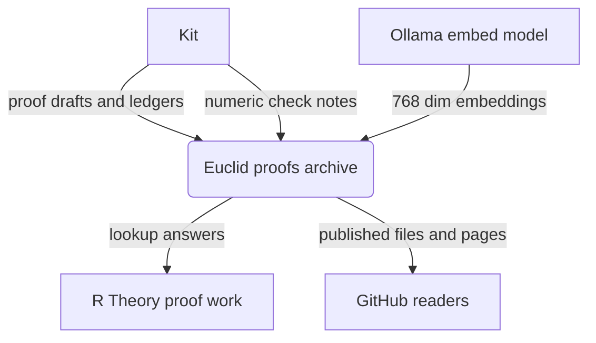
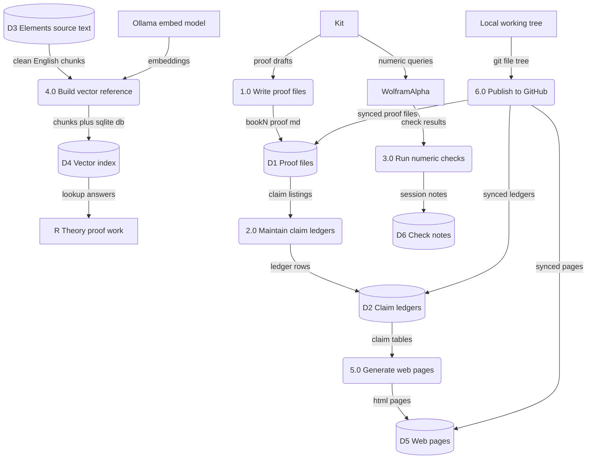
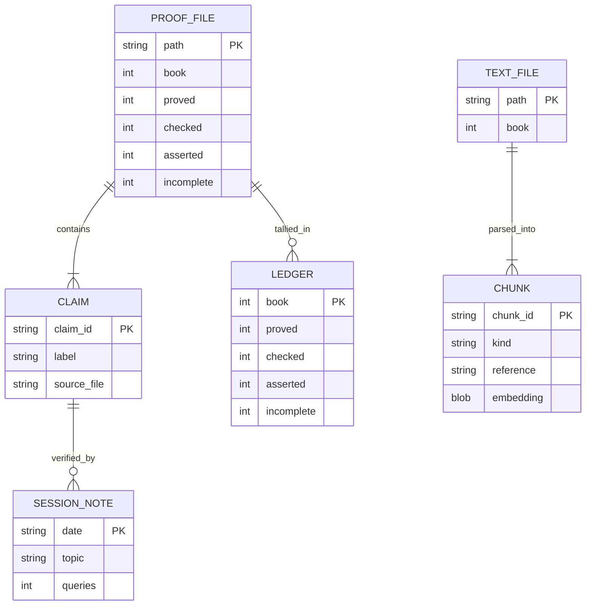

Living document — update these diagrams when adding features.

# euclid-proofs — Architecture

## 1. Context diagram (level 0)

## 2. Level-1 data flow diagram

## 3. Entity–relationship diagram

## Grounding notes

- OBSERVED: 152 files across `books/`, `ledger/`, `trig_proof/`, `vectors/`, `docs/`, `guide/`, `text/`, `wa_sessions/` plus `verify_P21.py`, `verify_P21.wl`, `push_to_github.py`. No root README exists (404).
- OBSERVED: `books/` holds 21 proof files `seed_double_angle.md` plus `book0_proof.md` through `book20_proof.md`, and `MASTER_LEDGER.md` states campaign totals of 493 PROVED, 79 CHECKED, 209 ASSERTED, 32 INCOMPLETE.
- OBSERVED: `trig_proof/` holds per-book `bookN_claims.md` files, cumulative proofs, `STATUS.md`, `REEVALUATION.md`, `FINAL_EXAM.md`.
- OBSERVED: `vectors/README.md` describes `parse_elements.py` to 606 chunks, `embed_elements.py` via Ollama `nomic-embed-text`, `search_elements.py` lookup, and `elements.db` with `chunks` and `chunks_fts` FTS5 tables. It calls the reference the standing source for Euclid lookups in R Theory extension-proof work.
- OBSERVED: `docs/build_pages.py` generates the HTML pages from claim data; `wa_sessions/` holds dated WolframAlpha numeric-check transcripts; `push_to_github.py` pushes the local working tree to this repo.
- INFERRED: external entity "GitHub readers" — the repo is public, but no reader activity was observed.
- INFERRED: the overall purpose framing "published archive of the proof campaign" — there is no README; the purpose was assembled from file contents.
- INFERRED: the exact trigger cadence of the publish script was not observed; the script itself and its docstring are observed.
