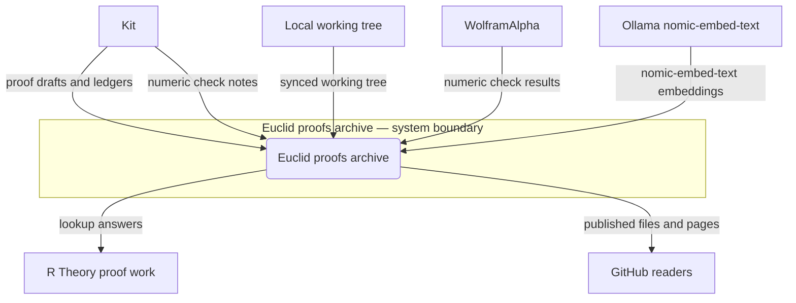
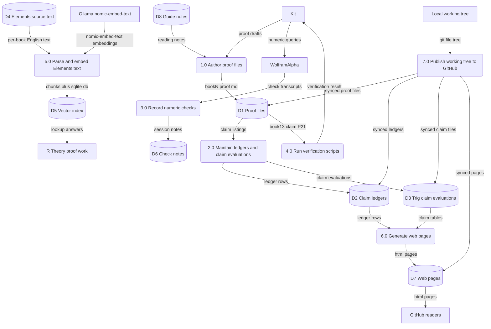
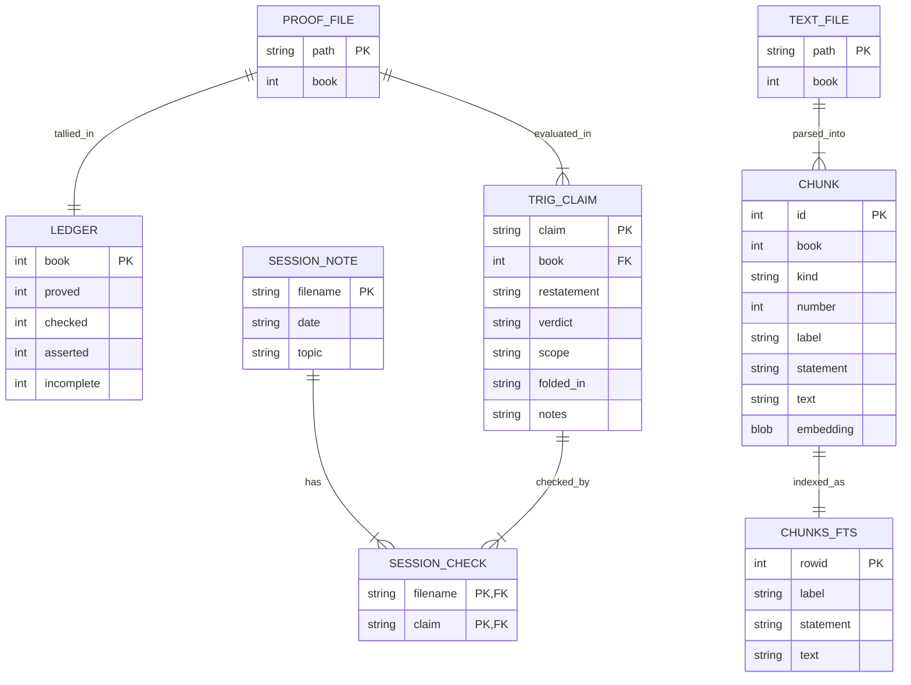

Living document — update these diagrams when adding features.

# euclid-proofs — Architecture

Published archive of the Euclid book-proofs campaign and its trig-extension
evaluations: proof files (Books 0–20), claim ledgers, cumulative trig-proof
claim tables, a vectorized Euclid's Elements reference, WolframAlpha
numeric-check transcripts, independent verification scripts, and generated
HTML pages.

## 1. Context diagram (level 0)

## 2. Level-1 data flow diagram

## 3. Entity–relationship diagram

`SESSION_NOTE` relates many-to-many to `TRIG_CLAIM` through the junction
`SESSION_CHECK`: one transcript checks several claims; one claim may be
checked across several transcripts. `CHUNKS_FTS` is the FTS5 index on the
`CHUNK` text columns (one index row per chunk). Generated HTML pages
(`docs/`) are not modeled as entities — they are rebuilt views of
`D2`/`D3` content.

## Grounding notes

- OBSERVED: repo tree on `main` (2026-09-28) — 153 entries under `books/`,
  `docs/`, `drive_upload/`, `guide/`, `ledger/`, `text/`, `trig_proof/`,
  `vectors/`, `wa_sessions/` plus `verify_P21.py`, `verify_P21.wl`,
  `push_to_github.py`. No root `README.md` (404 on contents listing).
- OBSERVED: only commit since 2026-09-28 is `a40652f0` (2026-09-28T21:23,
  "docs: add SAD architecture doc"). Latest research commits: `2136a57b`
  live ledger dashboard (`docs/ledger/`), `418f7afd` book21/22 pages,
  `1ffdc654` WA session log 2026-09-26 17:40, `91092f74` final exam
  adjudicating 188 ASSERTED items, `6efb2772` prove-what-we-can pass
  (P33/P34/P40/P44/C28/7.1.T2 → PROVED).
- OBSERVED: `books/` holds 22 proof files — `seed_double_angle.md` plus
  `book0_proof.md` through `book20_proof.md`. `books/MASTER_LEDGER.md`
  (compiled 2026-09-22, repaired same day) states campaign totals
  493 PROVED / 79 CHECKED / 209 ASSERTED / 32 INCOMPLETE at claim level.
- OBSERVED: the ledger header also says "all 21 files" for
  `seed_double_angle.md` + `book0`–`book20` (22 paths), and its §F repair
  arithmetic sums to 492 PROVED, not 493 — internal inconsistencies in the
  ledger itself, not adjudicated here.
- OBSERVED: `ledger/` holds 13 per-book ledgers (`book1_ledger.md` …
  `book13_ledger.md`). `trig_proof/` holds 23 claim tables
  (`book0_claims.md` … `book22_claims.md`) with columns Claim |
  Restatement | Verdict | Scope | Folded-in? | Notes (seen in
  `book0_claims.md`), plus `cumulative_trig_proof.md`,
  `STATUS_RACED_2026-09-22.md`, `cumulative_trig_proof_RACED_2026-09-22.md`,
  `FINAL_EXAM.md`, `STATUS.md` (Books 0–22, exactly one label per claim),
  `REEVALUATION.md`, `T2_EPS_OFFCHART_PROOF.md`.
- OBSERVED: vector store is real code, not a claim — `vectors/README.md`
  (606 chunks: 465 propositions, 118 definitions, 5 postulates,
  5 common notions, 13 book intros), `parse_elements.py` (docstring:
  output `chunks.json` list of `{book, kind, number, label, statement,
  text}`), `embed_elements.py` (docstring schema:
  `chunks(id INTEGER PK, book INT, kind TEXT, number INT, label TEXT,
  statement TEXT, text TEXT, embedding BLOB float32)` and
  `chunks_fts(label, statement, text)` FTS5; model `nomic-embed-text`
  against `http://localhost:11434/api/embeddings`), `search_elements.py`
  (lookup tool), `elements.db` (5.4 MB binary in repo). README calls it
  "the standing source for Euclid lookups in R Theory extension-proof
  work" — grounding for the `lookup answers` flow to `E4`.
- OBSERVED: `wa_sessions/` holds 36 dated WolframAlpha transcripts
  (`2026-09-22-0430.md` … `2026-09-26-1740.md`); the 2026-09-26 17:40
  transcript covers principal-chart saw identities (numeric checks only,
  interpretation Kit's call).
- OBSERVED: `verify_P21.py` + `verify_P21.wl` — independent numeric
  verification of P21 in `book13_proof.md` (Cauchy–Schwarz duration
  bound). The scripts print results to stdout; no persisted result file
  was observed.
- OBSERVED: `docs/build_pages.py` generates `docs/index.html`,
  `docs/book21/index.html`, `docs/book22/index.html` from claim data
  transcribed from `trig_proof/book21_claims.md` /
  `book22_claims.md`. `docs/index.html` links a live ledger dashboard
  (`docs/ledger/`) that "reads the campaign ledgers straight from the
  repository on every load"; the book21 page states 13 claims evaluated
  2026-09-26: 6 PROVED · 2 CHECKED · 5 ASSERTED · 0 INCOMPLETE.
- OBSERVED: `push_to_github.py` pushes the local `~/workspace/euclid_work`
  git tree to this repo via the Git Data API (docstring + `WORK` path) —
  grounding for `E6` → `P7` flows.
- OBSERVED: `guide/` holds 6 reading-guide/note files
  (`creative-reason-guide.md`, `critique.md`, `draft_guide.md`,
  `notes_elements.md`, `notes_euclid_bio.md`, `notes_pedagogy.md`);
  `drive_upload/euclid.html` (316 KB) is present but its purpose is not
  established — omitted from the diagrams.
- INFERRED: external entity "GitHub readers" — the repo is public and
  `docs/` publishes HTML pages, but no reader activity was observed.
- INFERRED: `P4` output flow "verification result" → Kit — the scripts
  exist and run, but no destination in the repo was observed.
